# Hello World!
### My name is Vladislav aka u/vlad, I am app developer (in general)
Have an experience in desktop, mobile, web and game development

## Languages, tools and frameworks

### **... and always ready to know more!**

## My projects
I can't be proud of all my projects, but I have to show it

### My Dart/Flutter projects:

### My Dart/Flutter contributions:

### My only C++ project repo:

### My main Web/NodeJS projects:

### Some of my gamedev projects:

## **Contacts**

- [**Website**](https://debils.tech)
- [**Telegram**](https://t.me/uslashvlad)
- [Steam](https://steamcommunity.com/id/uslashvlad)
- [ВКонтакте](https://vk.com/uslashvlad)
- [**Work mail**](mailto:debils.technologies@gmail.com)
