# Hello World! 😃

My name is Vladislav aka u/vlad. I am 20 year old, and I am from Russia. Currently I am a student in RTU MIREA (3rd year). I have some experience in desktop, mobile, web and game development, so I am an app developer in general, but always happy to create some interesting or funny stuff!

### General languages and tools:

### Some other , ,  and  that I am currently using or was using in previous projects:

**... and always ready to know more!**

# Some of my projects:

### My Dart/Flutter projects:

### My C++ projects:

### My main Web/NodeJS projects:

### Some of my gamedev projects:

## **Contacts**

- [**Website** _(currenly under maintenance)_](https://debils.tech)
- [**Telegram**](https://t.me/uslashvlad)
- [Steam](https://steamcommunity.com/id/uslashvlad)
- [ВКонтакте](https://vk.com/uslashvlad)
- [**Work mail**](mailto:debils.technologies@gmail.com)
